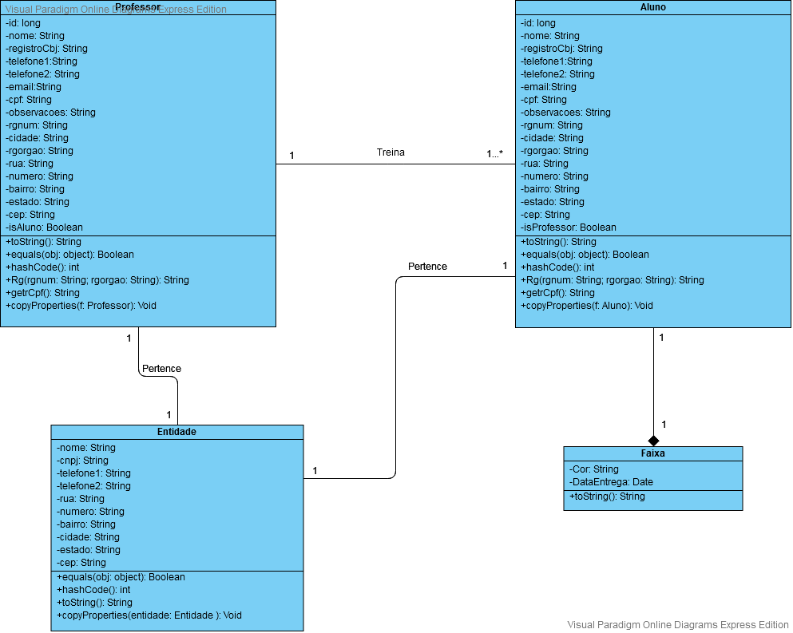

# JUDOCAS - 2.0

**Mantenedores**
|      Nome        |    TIA    |
|------------------|-----------|
| Bruno Fiore      | 31700713  |
| Felipe Pena      | 31709850  |
| Guilherme Sette  | 41783441  |
| Luiz Henrique    | 41719468  |
| Rafael Pereira   | 31647898  |

-> Repositório: [GitHub](https://github.com/GuilhermeeSette/Judocas-2.0)

-> Ambiente de Produção: [App](https://judocas.herokuapp.com/)

-> Board de Gerenciamento: [Board](https://github.com/GuilhermeeSette/Judocas-2.0/projects/1)

## Arquitetura
---

&nbsp;

&nbsp;

&nbsp;

&nbsp;

&nbsp;

&nbsp;

&nbsp;

&nbsp;

## Modelagem
---

&nbsp;

&nbsp;

## Stack
---
- Ruby on Rails
- HTML
- CSS
- JavaScript
- PostgreSQL

Hospedado em [Heroku](www.heroku.com)
